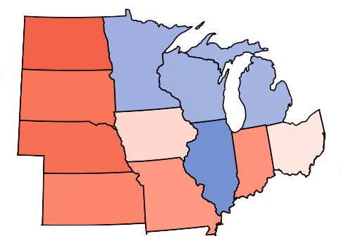
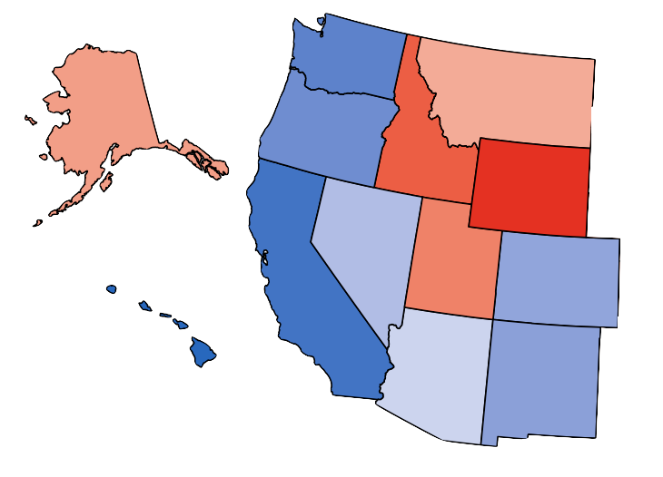
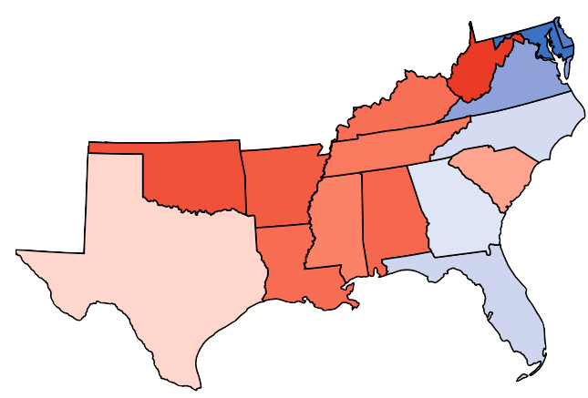
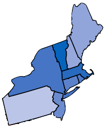

```{r setup, include = FALSE}
library(tidyverse)
library(shiny)
library(usmap)
library(maps)
library(ggcorrplot)
library(ggplot2)
library(kableExtra) # for example code; delete if not needed
library(SentimentAnalysis)
library(dplyr)
library(tidytext)
library(magrittr)
library(stopwords)
library(lubridate)
library(factoextra)
library(wordcloud)
```

# Revisiting the 2020 Election

```{r images, include=FALSE}
# Define variable containing url
urlbiden <- "https://www.nydailynews.com/resizer/nGz42Mac6j-lUSejP2zvhsH2VOQ=/1200x0/top/arc-anglerfish-arc2-prod-tronc.s3.amazonaws.com/public/KGG26PNB4REMXHEN6U3SABTSXE.jpg"

urltrump <- "https://9b16f79ca967fd0708d1-2713572fef44aa49ec323e813b06d2d9.ssl.cf2.rackcdn.com/1140x_a10-7_cTC/20200922awTrumpSpeech09-4-1600859223.jpg"
```
<center></center>

2020 was a _hectic_ year. Looking back, specifically at the election, our project group wanted to better understand which events, trends, and other factors had the greatest impact on the U.S.'s Presidential Election. To examine these factors, we looked at a wide range of datasets in order to gain the broadest possible view of issues relevant to the American electorate during 2020. In addition to election forecasting data from FiveThirtyEight, we used data from Johns Hopkins University on the COVID-19 Pandemic, stock market data from Yahoo Finance, and data on articles in the Wall Street Journal to gain an insight into the election and potential affecting factors. 

## Interactive Map

The map doesn't update after you click on the slider four times, so try refreshing the page if it doesn't update. Click [this link](https://lromualdo24.shinyapps.io/blog_map/) to view the map in a separate window.

```{r map, echo = FALSE, message = FALSE, warning = FALSE, out.width = "100%", out.extra = 'data-external="1" frameborder="no"'}

knitr::include_app("https://lromualdo24.shinyapps.io/blog_map/",
                   height = "400px")
```

To build our interactive map, we used the package `usmap` and Shiny. First, we took the `state_toplines` dataset, which included each candidate's performance by state on each date, and used a slider input to select entries from a certain date (thereby leaving 50 entries for each state on the given input date). These data entries contained the margin in each state, or Trump's predicted percentage of the vote minus Biden's. Next, using the `usmap` package, we displayed this data in map form, using the function `scale_fill_gradient2()` to color each state by their respective margins. However, we realized that the variation margin blanked out a lot of states on the map: for example, if Biden is doing 10% better than Trump in Virginia, 1% better in Pennsylvania, and 30% better in Vermont, Vermont would appear deep blue on the map, but both Virginia and Pennsylvania would appear in a very pale shade of blue. This made it difficult to distinguish between each state's level of support for the candidates because only the most extreme states would appear in color. Thus, we took the square root of the margin in order to magnify the differences between states with margins close to 0 (where the candidates are running neck-and-neck), while ignoring the differences between a Biden +20 and a Biden +80 state, for example.

## Data & Methodology

Our first step in analyzing the path of the election was finding a dataset to illustrate the state of the race over time. FiveThirtyEight, which maintained a predictive model of the 2020 election, had data on each candidate's predicted share of the vote by date from June 1st until election day. Using [this dataset](https://github.com/fivethirtyeight/data/tree/master/election-forecasts-2020), we were able to compare America's political leanings on given dates to the progression of other variables recorded daily (such as stock prices and COVID-19 data).

Once we had the election data, our next step was to analyze it. Some analysis could be done with this data alone — we looked at the correlations between states in the same region, asking, as states' preferences changed from day to day, how similar were their changes to those in neighboring states? While this provided a geographic relationship between states' voting patterns, we needed data relating to other pressing national issues to understand how they related to the election. We also used urbanization data from FiveThirtyEight to examine how a state's geographic diversity might affect its voting patterns.

The first factor that came to mind was the COVID-19 pandemic: given the dramatic way in which the pandemic affected American life, from remote work, school over Zoom, panic buying, quarantining for the infected and their close contacts, masking, unemployment, and more, we felt that the pandemic likely had a tangible effect on the election. Moreover, since COVID-19 cases and deaths were recorded on a daily basis, we would be able to look at how a worse COVID-19 situation on a certain date might correspond to changes in the country's preferences in the election. To find this data, we used the [Johns Hopkins University COVID-19 Dashboard's data](https://github.com/CSSEGISandData/COVID-19/tree/master/csse_covid_19_data/csse_covid_19_time_series), given that the dataset was public and that JHU was one of the first places that aggregated and published global COVID-19 data from the very beginning of the pandemic. 

The next factor we considered was the economy, a factor that has consistently ranked as the [most important issue](https://news.gallup.com/poll/321617/economy-tops-voters-list-key-election-issues.aspx) in U.S. presidential elections. While COVID-19 had a significant impact on the American economy, we figured that just measuring the economy through its relationship with the pandemic was insufficient. Thus, we wanted to find another measure for the economy. Unfortunately, the best economic indicators, such as unemployment and GDP, are released every quarter, or only twice during the time period in our data. Because of this, comparing the U.S. economy to daily fluctuations in the election was impossible using those ideal metrics.

> *"It's the economy, stupid."*
> ~ James Carville, 1992 Presidential Campaign Manager for Bill Clinton (D)

Instead, we moved forward with the stock market as an indicator of the economy, given that the stocks of major companies tend to rise, on average, when confidence in the economy's trajectory rises (and vice versa). Thus, while the stock market does not measure actual economic performance, it can provide a proxy for the economy as a measure of investor confidence. Moreover, we were able to use a variety of datasets to gain insights into specific segments of the economy as well. 

Using historical stock data from [Yahoo Finance](https://finance.yahoo.com/quote/%5EGSPC/history), we not only used daily data of the S&P 500, which is generally considered as a baseline measure of the overall market, but also the performance of industry-related ETFs (exchange-traded funds). These funds are an aggregation of major companies in certain industries; by using the price performance of these ETFs, we could see how investor confidence in healthcare companies, industrial companies, and energy companies changed from day to day. We considered that, when it came to these specific industries, we might even see a reverse causality relationship between a candidate's performance and a certain industry. Joe Biden, for example, emphasized combating climate change and greater nationalization of healthcare during the campaign; we might expect, then, to see health insurance companies and oil companies perform worse on days that Biden's standing in the polls was increasing.

A third stock-related measure we included was an average of politically-linked companies' stocks. We looked at each party's top five corporate donors and averaged their standardized stock performance (dividing their daily stock prices by the company's price on June 1st) to see how companies linked to a certain political party might be doing based on how their chosen candidate is performing. One significant caveat with this data is that no major public company donated a significant amount to the Republican Party in either 2020 or 2016. While we were able to find the Democrats' top corporate donors in 2020, the most recent election in which major public companies contributed significantly to the Republican Party was 2012, when the candidate was Mitt Romney. Given the significant political differences between Romney and President Trump, we considered that Romney's supporters in the corporate world would likely have very different views of Trump, such that their performance may be only weakly-linked, at best, to Trump's standing in the polls.

Lastly, in order to get a more comprehensive view of the issues affecting the election, we scraped data from the headlines and body text of Wall Street Journal articles from the time period in question. By looking at what key words were most commonly used over time, as well as which candidates those words were associated with, we were able to gain a better understanding of what issues were emphasized in the media the most, and which candidate was more closely linked to those issues. 

Having collected all of this data, let's take a look at the results.

# What factors influenced the 2020 election? {.tabset .tabset-fade .tabset-pills}

To analyze the key issues influencing the 2020 election, we created a set of visualizations based on our data collection to illustrate to relationship between voters' preferences and other variables. Using these visualizations, we aimed to determine possible relationships between the aforementioned issues (and their representations in the data) and politics. 
Click on the tabs below to see the visualizations, read our analysis, and understand some of the trends and issues that did or did not influence the election, and how they sized up compared to our initial expectations.

## State & Regional Similarities

The first visualization we created use just the election data from FiveThirtyEight, delineated by state. Before looking into issues that may have had an impact on the election, we wanted to see how closely related voting patterns across the country were with each other. To accomplish this, we calculated and plotted the correlations between each state's voter preferences with each other, divided up by region. That is to say, we found how closely an increase in Biden's support in, for example, New York, would relate to a possible increase in Biden's support in Connecticut. 

Click [this link](https://lromualdo24.shinyapps.io/blog_heatmap/) to view the heatmap in a separate window.

```{r heatmap, echo = FALSE, message = FALSE, warning = FALSE, out.width = "100%", out.extra = 'data-external="1" frameborder="no"'}

knitr::include_app("https://lromualdo24.shinyapps.io/blog_heatmap/",
                   height = "500px")

```

### Methodology

To create the correlation heatmap, we took the `state_toplines` dataset and calculated the correlations between all 50 states using the `margin` variable. Imagine creating a scatterplot with the margin in one state on the x-axis and the margin in another state on the y-axis, where each data point represented a date: for our new dataset, we would use the correlation calculated from this data between these two states, repeated for every combination of the 50 states. Next, we saved these correlations to a data frame in the form of a matrix (like a table with 50 rows with all of the states and 50 columns with those states, and the cells containing the relevant correlations). While this process was not especially efficient, the `ggcorrplot` package, which is needed to create a heatmap, required that the data be inputted in this matrix format. However, calculating correlations between all 50 states was not feasible given this process, so we instead opted to stratify our data by region, using the census bureau's regional assignments to split our data. Once we calculated the correlations between states in each region, we created matrices for each region and input them into the `ggcorrplot()` function to create heatmaps for each region.

### Findings
The results displayed in this correlation heatmap were not too surprising. Within each region, nearly all state pairings had a positive correlation with each other: for example, if Biden was doing better in Washington on a certain day, he was likely doing better in Oregon as well. 

<center></center>

However, there were exceptions to this pattern: Illinois, for example, was not related to any of the other Midwestern states (except Michigan), wherein changes in voter preferences in Indiana or Wisconsin led to generally opposite changes in Illinois. The explanation for this, however, is fairly simply: Illinois is the only Midwestern state with a major city (Chicago). In fact, the states that had the least negative correlation with Illinois were, in order, Michigan, Ohio, Missouri, and Minnesota, all of which have major cities like Detroit, Columbus, Cleveland, St. Louis, Kansas City, and Minneapolis. Meanwhile, Midwestern states without a large or medium-sized metro area, such as Iowa and Nebraska, were the most negatively correlated with Illinois (a state where half of the population lives in the Chicago area). 

<center></center>

Another unusual state was Hawaii. Though it was not as negatively correlated with other Western states as Illinois was with its neighbors, there was a reasonably negative relationship between Hawaiian voters' preferences and those of Washington, Montana, California, Arizona, and Alaska. This may simply be because Hawaii is not similar to the other Western states. It is an archipelago in the Pacific, rather than being part of the main continent, and is also demographically unique: 37% of Hawaiians are Asian (compared to about 5% for the nation as a whole), 10% is Native Hawaiian (whereas less than 1% of the U.S. population is indigenous), and 23% of Hawaiians are mixed-race, compared to less than 5% of Americans. It seems reasonable, then, that Hawaii would be less related to other states.

<center></center>

One region where the correlations were less strong across the board was the South: in particular, Mississippi and Arkansas were negatively correlated with most of their neighbor states. The reason for this is less clear; it is possible that socioeconomic status could be a factor, given that Arkansas and Mississippi are two of the least wealthy states, and also have lower average education levels and life expectancies than other states. We could see, therefore, how their voters' priorities might differ from more 'average' states in the region. Moreover, because both Mississippi and Arkansas are not swing states (they are two of the most Republican states in the country), we did not feel that a deeper investigation into their voting patterns was especially relevant, given that changes in their voting patterns would almost certainly not have altered the outcome of the election. Further investigation into these two states could, however, be helpful for a deeper and more thorough analysis.

> "The correlations actually measure how states' preferences move with each other."

<center></center>

Predictably, there was very little dissimilarity in political preferences in the Northeast. However, it was somewhat surprising that the least-related state in the region, compared to its neighbors, was Vermont. Given that Pennsylvania is the most Republican state in the region (while the others are all generally supportive of Democrats), we expected Pennsylvania to be the least related. Vermont, meanwhile, is the _most_ Democratic-leaning state in the region. When considering this finding, the answer seemed to be related to what the correlations were actually measuring: while the initial assumption was based on a state's general political leanings, the correlations actually measure how states' preferences move with each other. For example, New York is significantly more Democratic-leaning than Pennsylvania; yet, if 1% of voters moved from supporting Biden to supporting Trump on the same day in both states (and a similar pattern held throughout the election cycle), then New York and Pennsylvania would be highly correlated even though their electorates have very different political views. Meanwhile, New York could be politically very similar to Vermont, but, if on a given day, 1% of voters in New York move from Biden to Trump while 1% of voters in Vermont move from Trump to Biden, and this pattern continued, then the two states would not show up as very correlated. This might explain why Vermont was the least-correlated state in the Northeast: as the most Democratic-leaning state, it is unlikely that their voters changed their minds much over the course of the election cycle, while voters in another, more balanced state like New Hampshire might change preferences more often, such that Vermont would not present as highly correlated with New Hampshire.

### Conclusions

Ultimately, this correlation plot helped confirm for us that, for the most part, states' voting patterns are reasonably closely-related to each other. In fact, when calculating the correlations between regions, we found that all regions' voting patterns were positively correlated with each other. Because of this, we found that changes in Biden's support in one state, for the most part, corresponded to similar changes in most other states. As such, we were more confident in  using _national_ election prediction data instead of delineating it by state, seeing as a change in the national trend would, for the vast majority of states, correspond to a similar trend statewide. Moreover, we learned a key distinction when it comes to correlating states: just because two states are similarly Democratic- or Republican-leaning does _not_ mean that they are highly correlated. The correlation instead stems from how voters in those states change their opinions over the course of the election cycle, and if those changes are similar between states.

## Geographic Factors

Seeing that state voting patterns across the country are somewhat related to each other, we decided to look another factor that varies by state: Urbanization. To create this plot, we collected data from FiveThirtyEight on states' urbanization index, calculated on a logarithmic scale. A higher urbanization index indicates a more urban city. The urbanization index is plotted against the expected margin that Trump will win each state from November 3rd, 2020. Red points indicate a red state (Trump won) and blue points indicate a blue state (Biden won). The scatterplot currently shows all 50 states, but using the drop down select bar, you can delete states that you'd like to remove from the plot to highlight or view a specific state. Where on the plot does your state lie?

For more about urbanization and politics, check out [this feature from FiveThirtyEight](https://fivethirtyeight.com/features/how-urban-or-rural-is-your-state-and-what-does-that-mean-for-the-2020-election/) which uses the same data. To view the scatterplot in another window, click [here](https://lromualdo24.shinyapps.io/blog_urb/).

```{r urbanization, echo = FALSE, message = FALSE, warning = FALSE, out.width = "100%", out.extra = 'data-external="1" frameborder="no"'}

knitr::include_app("https://lromualdo24.shinyapps.io/blog_urb/", height="800px")

```

### Methodology 

This plot was simply a scatterplot between urbanization and a state's political leanings; for the latter point, we used the state's predicted margin on election day (11/03/2020), while using the aforementioned `urbanization-state.csv` dataset to ascertain each state's urbanization index. However, beyond just creating a scatterplot using `ggplot`, we added a reactive component using Shiny, creating checkboxes for each state. Doing so allows users to select which states they want to see on a plot.  

### Findings
The scatterplot above has one glaringly obvious trend: all of the red points have generally lower urbanization indices than the blue points, other than the few outliers. This means mostly all the states that supported Biden in the 2020 election were considered more urban states than those that supported Trump. The states with the lowest urbanization indices are Wyoming (8.26), Montana (8.47), and South Dakota (8.72). The states with the highest urbanization indices are New York (12.56), New Jersey (12.24), and California (12.19).

Although there are not many, we can see a few outlier on the above plot. Firstly, the Trump favored states with the highest urbanization indices are Ohio, Utah, and Texas which are all around 10.9-11.1. This is right around the middle of the distribution for the urbanization inidices of all the blue states, meaning that although they have similar urbaniation indices, the majority still voted for Trump. Another unusual point that can be seen is some of the low blue points. The two lowest blue points are Vermont and Maine, which both have an urbanization index around 9. These states are some of the least urban states based on this scale, but are still blue states where the majority supports Biden.

### Conclusions
Based on the scatterplot comparing expected margin (favoring Trump) and urbanization index in each state we can deduce that urbanization does play a role in the results of the 2020 election. The more urban a state is, the higher support there is for Biden. This is likely due to the larger populations in urban states and the presence of densely populated cities.

## National Factors

The second visualization we constructed was meant to convey a more thorough and comprehensive view  of the connections in the data we sought to investigate. To accomplish this, we created an interactive scatterplot using the majority of data we collected: national polling and election predictions from FiveThirtyEight, stock market, industry, and company stock data, COVID-19 cases and deaths, and more.

On the scatterplot below, choose x- and y-axis variables, as well as variables to color and size the points on the chart, to see how different variables changed with each other over the course of the election season. If you want to take a more minimalistic approach, select 'none' to remove a graph feature (like varying the points' color or size). If you want to see how variables changed over time, select 'Date' as your x-axis variable. To view the scatterplot in another tab, click [here](https://lromualdo24.shinyapps.io/blog_scatter/).

```{r scatterplot, echo = FALSE, message = FALSE, warning = FALSE, out.width = "100%", out.extra = 'data-external="1" frameborder="no"'}

knitr::include_app("https://lromualdo24.shinyapps.io/blog_scatter/", height="500px")


```

### Methodology

To create the interactive scatterplot, we used a similar process as with the urbanization plot. Once the data was collected (all quantitative variables), we wanted to use Shiny to allow users to select which variables to see. In the Shiny UI function, four input menus were created: one for the x-variable, one for the y-variable, and input variables to size and color the points. However, recognizing that too many variables might overwhelm users, we also added a 'None' option to each input menu in case differentiating between points' size and color was unnecessary. Using a reactive `ggplot` scatterplot in Shiny, we created the interactive scatterplot.


### Findings
In creating this interactive scatterplot, we noticed some interesting, and many surprising, relationships. Unsurprisingly, the most closely-related variables were the ones that were proxies for similar concepts (COVID cases and deaths, for example were highly correlated, as were Biden's expected share of the popular vote and his expected share of the electoral vote). However, some relationships stuck out as particularly strong: COVID cases and deaths, for example, were somewhat related to the performance of the industrials and energy industries, suggesting that investor confidence in energy and industrial companies may have been affected by their perceptions of the pandemic's severity. However, most surprisingly, COVID was not as closely correlated with the healthcare industry, even though companies like hospital providers and medical technology producers (that made equipment like ventilators) would have been expected to benefit from a new widespread disease. 

### Surprising Results
We were also surprised to see that our polling metrics (Biden's expected popular vote and expected electoral vote) were not closely related to either COVID-19 or the stock market, indicating that neither the state of the pandemic nor investor confidence were good short-term predictors of Biden's standing in the polls. It is unclear why this might be the case — it is possible that stock market confidence is a poor indicator of wider economic performance (for example, the stock market recovered to pre-pandemic levels by the summer of 2020 when the U.S. was still in a recession). Meanwhile, the effects of COVID-19 on the election may have already been priced in, since the pandemic began in March and was at its most shocking near the start, when lockdowns were first enacted. Since our election data only begins in June 2020, it is possible that the effect COVID-19 was more of a one-time shock to the election (as opposed to public opinion shifting depending on the temporary severity of the pandemic by case and death count), such that the effect was already accounted for by the time our data began. 

Another surprising find from this plot was the relationship between Democrats' performance in the polls and the stocks of companies that donated to them. The correlation between Biden's standing and Democratic-linked companies, as well as Republican-linked companies, was quite low (and both correlations were negative, such that, on days that Biden was better-preferred by voters, both Democratic-allied and Republican-allied companies were generally performing worse in the markets). For Democrats, the five companies were Google, Amazon, Microsoft, Disney, and Blackstone; for Republicans (for whom 2012, rather than 2020, data was used, as no major public companies supported the GOP during either 2020 or 2016), the major companies were Goldman Sachs, JPMorgan Chase, Blackstone, Las Vegas Sands, and KKR. 

One possible reason for this outcome is the nature of how these companies were found: the five companies chosen for each party were the ones with the most recorded donations to each party; however, this solely represents the political views of company employees, the strength of those opinions, the number of employees at a company, and their wealth (perhaps explaining why financial firms featured so prominently on the company lists). However, employees may not make political donations based on what outcome would be best for their company's business: would you expect a warehouse stocker for Amazon to choose their candidate based on what was best for Jeff Bezos and his deputies? 

### Conclusions

Ultimately, we couldn't find any obvious factors influencing the 2020 election based on this plot. Biden's performance in the polls was simply not closely linked to other daily data points. 

## Headlines Analysis

Next, we wanted to gain a better understanding of the specific events and issues that were shaping the election: to get a pulse on the national conversation, we scraped the headlines from _Wall Street Journal_ articles in the relevant time period (6/1/2020 to 11/3/2020). Using these headlines, we created a wordcloud displaying the most common topics in the news in a given timeframe.

```{r wordcloud, echo = FALSE, message = FALSE, warning = FALSE, out.width = "100%", out.extra = 'data-external="1" frameborder="no"'}

knitr::include_app("https://lromualdo24.shinyapps.io/blog_wc/", height="500px")

```

This wordcloud is interactive: in order to show how the issues of national importance evolved throughout the election cycle, we allowed users to set a date range of interest, allowing them to see what topics were most newsworthy in a given time period; for example, issues like 'police' were frequently in headlines in the early summer of 2020, corresponding to Black Lives Matter protests. Likewise, 'China' and the 'pandemic' were constants throughout the year, demonstrating the continued importance of the pandemic in the media.

Following the word cloud, we wanted to delve deeper into the emotional sentiment of WSJ reporting and apply a more quantitative approach to embed the text matrix we have. To get a slight taste of latent semantic analysis for future research, we did some self-studying on different word embeddings and methods like principal component analysis and singular value decomposition and performed two kmeans clustering on the same text data frame embedded by two different lexicons(bing, nrc). We then displayed their results:

```{r sentiments, echo = FALSE, message = FALSE, warning = FALSE}

```

The graph on top used the bing lexicon and the graph at the bottom used the nrc lexicon. A bit of background information, NRC embeds every word into an 8-dimensional vector each representing a sentiment. The sentiments include anger, fear, anticipation, trust, surprise, sadness, joy, and disgust. Bing simply classifies words into positive ones and negative ones. So it seems that Bing’s embedding is more general and NRC’s embedding is more specific and fancy in a way. But as it turned out in our later analysis, a more specific lexicon might not always be the best choice when we as data science students are trying to convey ideas to our audience.

A brief introduction: our wrangled text matrix is a 156 row * 2 columns matrix: The first column is just a date sequence(from Jun. 1st, to Nov. 3rd) while the second column is a string collapsing all WSJ news titles of that day. 

For the bing lexicon, we embedded the matrix so that each day is represented by a 2-dimensional vector where the first dimension counts the number of positive words in news titles that day and the second dimension counts the number of negative words in news titles that day. We then performed kmeans clustering for a given set of dates that we can choose here and generated the plot. In our shiny app project, we discovered that Wall Street journal is a relatively conservative media that sees things in a more negative than positive light. From this plot, we further discovered that positive words and negative words seem to be negatively correlated in their frequency, which suggests that WSJ is a consistent media as well(the sentiments of their articles remain relatively stable in a given day, that positive news titles appear together and vice versa). A more dynamic/diverse reporting style would probably see a more random distribution of word embedding plots. 

For the NRC lexicon, because the word embedding represented each day with an 8-dimensional vector, some form of low-rank approximation is needed. In linear algebra, low-rank approximation generally refers to the practice of representing a matrix with fewer dimensions than it originally had by discovering a vector basis of fewer dimensions. Here we chose singular value decomposition, and because we wanted to plot our final nrc kmeans graph as a direct comparison to the bing kmeans graph, we chose to reduce our 8-dimensional vector to 2 dimensions and compare our clustering results.

What we can see from the graph is that the bing lexicon yielded a seemingly less random clustering result. Our hypothesis is that because our dimensionality reduction from 8 to 2 dimensions in nrc killed off too much variance within our text matrix and the resulting residual variance looks more random than the original one, which suggests that the text matrices themselves might not have that great of a pattern because there aren’t too many dimensions that explained significantly more variance within the dataset than others. 

In conclusion, we believed that even though nrc is a more specific lexicon, it may be hard to visualize. When we do try to visualize in a straightforward way, the nrc lexicon actually performs worse than a more general lexicon like bing which captures the main story of our dataset. It reminded us of what Professor Bailey said, when working in data science, we have to always keep in mind that we are facing an audience, and that effective communication of our ideas are often times much more important than simply showing off fancy technicalities. 

# Conclusion

This project allowed us to find surprising and useful trends that could help explain the results of not only the 2020 Presidential Election, but also future elections. 

The first useful factor we found is the correlation between voting patterns of states in the same region proves to be extremely useful in predicting what future voting patterns will look like. Since most states voting patterns are very highly correlated with the voting patterns of other states in their region, an event or change in the voting patterns in one state could be used to predict or foreshadow what will happen in a state in the same region.

Another factor that proved to be a factor in the 2020 election was urbanization. The scatterplot comparing expected margin (favoring Trump) and urbanization indices from each state shows a clear trend: the more urban states are more likely to lean left and support Democratic candidates.

Likewise, the wordcloud and sentiment analysis revealed key trends and noteworthy issues during the election, especially emphasizing the importance and effect of the pandemic on the national mood. This was clearest in the wordcloud, where 'China' and 'pandemic' were two of the most consistently and frequently used words in headlines, while other issues like 'police', 'protests', and 'stocks' cropped up but were less prominent.

Meanwhile, when examining the interactive scatterplot, we found that many seemingly-important issues did not directly relate to either candidate's standing in the polls. COVID-19 cases and deaths, for example, were not closely correlated with the national mood on a day-to-day basis, indicating that the pandemic's impact had a more general, long-term effect on politics, as opposed to an acute, daily effect. Likewise, the stock market was not closely related to political leanings, indicating that stocks are not a strong indicator about the public's overall feelings about the economy.

Future investigations could expand on this work: one would want to collect new, more detailed data to better understand the factors that impacted the election. For example, would surveys and polls on public opinion regarding specific issues help us better understand how those issues affected the election? What better metrics might there be of the economy that still contains daily data? How might our analysis change if some of these factors, like COVID-19 cases, were investigated on a state or local level? How do the sentiments and key topics in other newspapers differ from _The Wall Street Journal_, and, more importantly, how might public opinion diverge from media coverage?

#  Methodology Appendix {.tabset .tabset-fade .tabset-pills}

## Data

Over the course of our project, we used the following datasets:

* `state_toplines.csv` and `2020_toplines.csv`, two datasets [published](https://github.com/fivethirtyeight/data/tree/master/election-forecasts-2020) by FiveThirtyEight, used to develop their 2020 election prediction model (used in our interactive scatterplot, urbanization plot, and correlation heatmaps)
* `urbanization_state.csv`, a dataset [produced](https://github.com/fivethirtyeight/data/tree/master/urbanization-index) by FiveThirtyEight creating an index for how urban or rural a state is
* Historical stock price data from [Yahoo Finance](http://finance.yahoo.com) for major stock indices and ETFs to proxy for certain industries' performance
* We also used stock data for nine different public companies that donated significantly to each political party (based on [contribution rankings](https://www.opensecrets.org/parties/contrib.php?cycle=2020&cmte=DNC) from OpenSecrets), using these data points to create a 'stock index' for each party
* COVID-19 Case and Death data from Johns Hopkins University's [pandemic dashboard](https://github.com/CSSEGISandData/COVID-19/tree/master/csse_covid_19_data/csse_covid_19_time_series)
* Data scraped from headlines from _The Wall Street Journal_ during the election cycle, used to create a frequency wordcloud and sentiment analysis

## Developing the Interactive Map

To build our interactive map, we used the package `usmap` and Shiny. First, we took the `state_toplines` dataset, which included each candidate's performance by state on each date, and used a slider input to select entries from a certain date (thereby leaving 50 entries for each state on the given input date). These data entries contained the margin in each state, or Trump's predicted percentage of the vote minus Biden's. Next, using the `usmap` package, we displayed this data in map form, using the function `scale_fill_gradient2()` to color each state by their respective margins. However, we realized that the variation margin blanked out a lot of states on the map: for example, if Biden is doing 10% better than Trump in Virginia, 1% better in Pennsylvania, and 30% better in Vermont, Vermont would appear deep blue on the map, but both Virginia and Pennsylvania would appear in a very pale shade of blue. This made it difficult to distinguish between each state's level of support for the candidates because only the most extreme states would appear in color. Thus, we took the square root of the margin in order to magnify the differences between states with margins close to 0 (where the candidates are running neck-and-neck), while ignoring the differences between a Biden +20 and a Biden +80 state, for example.

## Limitations

While our work helped uncover key trends that shaped the 2020 elections, there were nevertheless some limits on our conclusions, posed by our methodology and available data.

One example can be found in the wordcloud: for feasibility reasons, we scraped titles from only _Wall Street Journal_ headlines; part of this was due to web availability of archives. _The New York Times_, for example, uses a different digital storage structure that made headline scraping difficult. Likewise, we weren't able to scrape all of the text of articles to analyze. As such, the data we used was limited to just the key words and themes of articles, as given in a headline, which may be problematic given that headlines are meant to grab attention and may not reflect the true scope or direction of an article. Likewise, we only scraped from one publication, meaning that the sentiments and focuses we analyzed come from only one journalistic perspective, with biases potentially permeating the data. This method also misses out on coverage from local news, TV/Cable news, and internet discussions, all of which are important forums when it comes to the national discourse and may even be more reflective of the nation's sentiments than national print journalism.

Another limitation was in our choice of method, choosing to analyze correlations and trends over time. Because an election only happens at one point in time, we chose to use election prediction model metrics as a proxy for a candidate's electoral performance. While this allowed us to see how certain events and trends may have had immediate effects on the election, prediction models are not the same as real results (in fact, FiveThirtyEight [called several states incorrectly](https://fivethirtyeight.com/features/how-fivethirtyeights-2020-forecasts-did-and-what-well-be-thinking-about-for-2022/)). This means that our data may not be reflecive of the political opinions we tried to measure. We considered delineating our data and calculating correlations by state, as opposed to time, but determined that other local/regional factors may have too great an impact on our results and misrepresent the effects of national trends on a national election.

A third concern we had related to the use of the stock market as a proxy for public opinion on the economy. The stock market is determined by investors, most of whom are not the average voter. The stock market did not, for example, track closely with other measures like unemployment, which remained high for many months after the pandemic began, even though the stock market had recovered from its pandemic-related collapse within several weeks. Ideally, we could have used more definitive measures of the economy like unemployment, GDP, or median household income. Unfortunately, many of these data points are only calculated by the month, quarter, or even year. Because of this, we would not be able to match these points to our daily data for COVID-19, industry indices, or the election prediction data. On a related note, the data we used for Republican-linked companies for the scatterplot was not ideal; no major public companies donated to the Republican Party in 2020 _or_ in 2016. As a result, the list of companies we used to construct a stock index for Republican-supporting corporations came from 2012 donation data. Simply put, Mitt Romney's donors are unlikely to be similar to Trump's, given their dissimilar temperaments and policy platforms. In fact, we found that these Republican-linked companies performed better in the stock market as Joe Biden improved in the polls, indicating that these ex-Republican-supporters in the corporate world may even view Biden's policies as more beneficial than Trump's.

The final major limitation of our work was that many of the factors affecting a national election are not easily quantifiable. Cultural and geographic factors, for example, may have evolved over the course of the election cycle and affected each candidate, but we had no way of measuring these factors on a day-by-day basis. As a result, our analysis is missing a pool of qualitative variables that may have had a far greater impact than other, better-quantifiable and measurable issues.

Despite these limitations, our work nevertheless produces useful information regarding the factors that affected the 2020 election.
